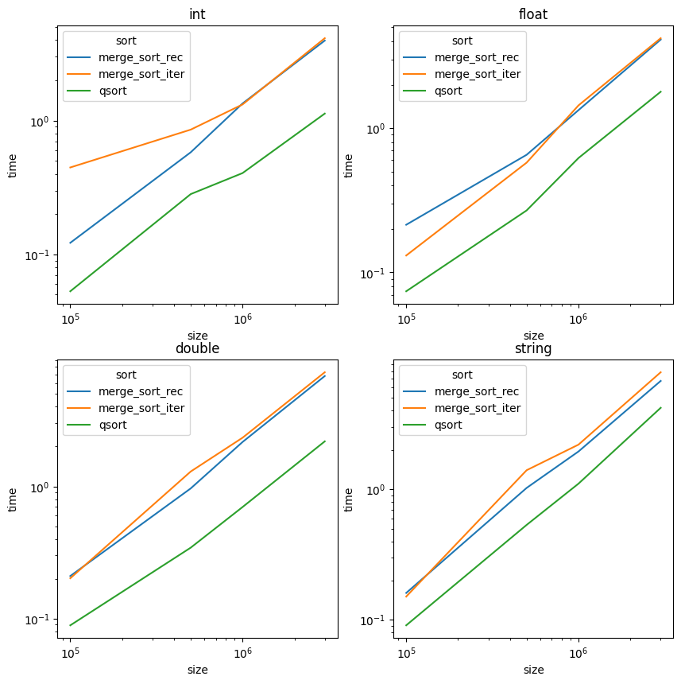

## Эко компонент сортировки слиянием

В проекте собираются два компонента,
предоставляющий методы сортировки с сигнатурой стандартной библиотеки qsort в виде подключаемых библиотек 
и Unit Test исполняемый файл, демонстрирующий работу методов и замеряющий время их работы.

## Cборка 

Производится с помощью **cmake** и компилятора MSVC в IDE clion. 
Библиотечные компоненты собираются как в динамические библиотеки `.dll`, так и `.lib`

**1F5DF16EE1BF43B999A434ED38FE8F3A** - Компонент с рекурсивной версией сортировки слиянием. 

**1F5DF16EE1BF43B999A434ED38FE8F3B** - Компонент с итеративной версией сортировки слиянием.

## Сравнение времени работы

Графики нарисованы в логарифмических осях, на них видно, сортировки уступают встроенной функции qsort по времени, однако имеют ту же 
алгоритмическую сложность - `O(n * log n)`

## Лабораторная №2

Компонент CEcoLab1 так же имплементирует 2 дополнительных интерфейса:
* `IEcoCalculatorX`
* `IEcoCalculatorY`

`IEcoCalculatorY` реализован при помощи механизма включения компонентов из InsideACOM 
`CEcoCalculatorD` или `CEcoCalculatorE`, для работы в той же папке, что и запускаемый исполняемый файл,
должны находиться соответствующие `.dll` файлы.

`IEcoCalculatorX` реализован при помощи агрегирования компонента `CEcoCalculatorB` или включения
компонента `CEcoCalculatorA`.
